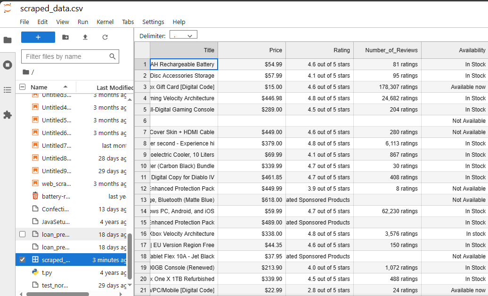

# E-Commerce data extraction with python
## Overview
This Python script was developed to gain experience as to how to scrape and build your own data for further analysis. This script scrapes all the Xbox related products details from an E-Commerce site search results. It extracts information such as product title, price, rating, reviews, and availability for a list of products related to a specific search query. After extracting the required info, it structures the fetched data into pandas dataframe and finally save the result to a csv file.

## Features
- **Product Details Extraction:** Extracts information about products listed on search results page, including title, price, rating, reviews, and availability.

- **Data Export:** Stores the extracted product information in a CSV file named.

## Libraries Used
**This script requires the following Python libraries:**
- **BeautifulSoup:** For parsing HTML content.
- **requests:** For making HTTP requests to the website.
- **pandas:** For handling and exporting data to a CSV file.

## Flow of the Script
- Uses requests to fetch the search results page.
- Parses the HTML content using BeautifulSoup.
- Extracts links to individual product pages from the search results.
- Iterates through each product link:
  - Fetches the individual product page.
  - Extracts product details using the defined functions.
  - Stores the extracted information in a Pandas DataFrame.
- Exports the data to a CSV file.

## CSV Generated after running the code

## Disclaimer
This script is for educational purposes and has been implemented only for self-learning purpose in an ethical manner.

